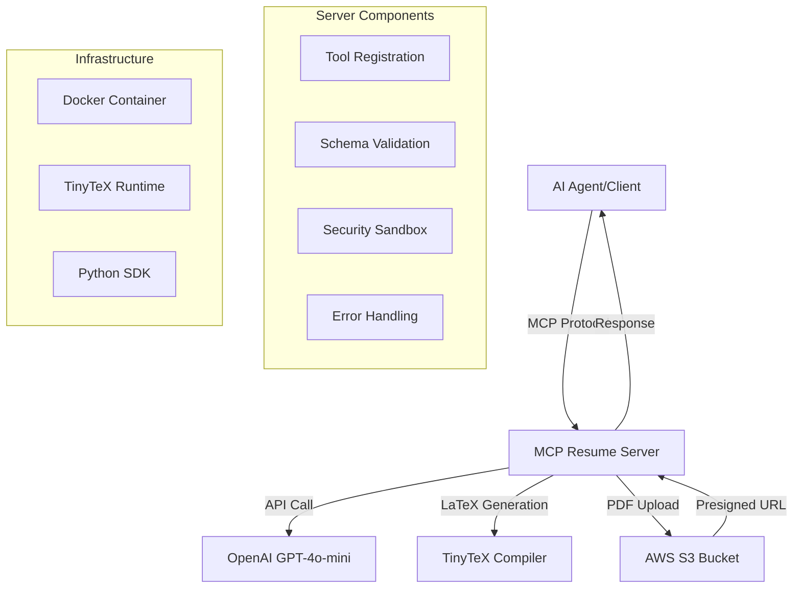

# MCP Resume Generator Server - Implementation Plan

## Project Overview
Create a production-ready MCP (Model Context Protocol) server that generates ATS-optimized resumes by:
1. Accepting user form data and job descriptions
2. Using OpenAI API to generate LaTeX content
3. Compiling LaTeX to PDF using TinyTeX
4. Uploading PDFs to S3 with presigned URLs
5. Providing a complete Docker deployment solution

## Architecture Diagram



## Implementation Plan

### Phase 1: Project Setup & Dependencies
**Estimated Time: 30 minutes**

1. **Initialize Project Structure**
   ```
   ai-resume-mcp/
   ├── src/
   │   ├── __init__.py
   │   ├── server.py
   │   ├── models.py
   │   └── utils.py
   ├── templates/
   │   └── moderncv_template.tex
   ├── tests/
   │   ├── __init__.py
   │   └── test_server.py
   ├── Dockerfile
   ├── docker-compose.yml
   ├── requirements.txt
   ├── .env.example
   ├── .gitignore
   └── README.md
   ```

2. **Install Dependencies**
   - Core: `mcp-sdk[fastapi,s3]`
   - AI: `openai`
   - AWS: `boto3`
   - Validation: `pydantic`
   - Utilities: `python-dotenv`, `uuid`

### Phase 2: Core MCP Server Implementation
**Estimated Time: 45 minutes**

1. **Define Data Models** (`models.py`)
   - `ResumeArgs` schema with form data validation
   - Response models for tool outputs
   - Error handling schemas

2. **Implement Main Server** (`server.py`)
   - Initialize MCPServer with proper configuration
   - Register the `generate_resume` tool
   - Implement async tool handler with proper error handling
   - Add logging and monitoring

3. **Core Features**:
   - **Input Validation**: Pydantic schemas for form data and job descriptions
   - **OpenAI Integration**: GPT-4o-mini API calls with optimized prompts
   - **LaTeX Processing**: Secure subprocess execution with timeout
   - **S3 Integration**: File upload and presigned URL generation
   - **Security**: Sandboxed LaTeX compilation, input sanitization

### Phase 3: LaTeX Template & Processing
**Estimated Time: 30 minutes**

1. **Template System**
   - Create base ModernCV LaTeX template
   - Dynamic field insertion based on form data
   - ATS-optimized formatting
   - Job description alignment logic

2. **Compilation Pipeline**
   - Secure temporary directory handling
   - LaTeX compilation with error recovery
   - PDF validation before upload
   - Cleanup and resource management

### Phase 4: AWS S3 Integration
**Estimated Time: 20 minutes**

1. **S3 Configuration**
   - Bucket setup and permissions
   - File naming conventions with UUIDs
   - Content-Type configuration for PDFs
   - Presigned URL generation with expiry

2. **Error Handling**
   - Upload failure recovery
   - Network timeout handling
   - Access permission validation

### Phase 5: Docker & Deployment
**Estimated Time: 25 minutes**

1. **Dockerfile Creation**
   - Multi-stage build for optimization
   - TinyTeX installation and configuration
   - Security hardening (non-root user)
   - Environment variable handling

2. **Docker Compose Setup**
   - Service orchestration
   - Environment variable management
   - Volume mounting for development
   - Network configuration

### Phase 6: Testing & Validation
**Estimated Time: 30 minutes**

1. **Unit Tests**
   - Tool registration validation
   - Schema validation tests
   - Mock API response testing
   - Error handling verification

2. **Integration Tests**
   - End-to-end resume generation
   - S3 upload/download validation
   - LaTeX compilation testing
   - Client-server communication

### Phase 7: Documentation & Deployment Guide
**Estimated Time: 20 minutes**

1. **Documentation**
   - API documentation with examples
   - Deployment instructions
   - Configuration guide
   - Troubleshooting section

2. **Production Readiness**
   - Environment variable templates
   - Health check endpoints
   - Monitoring and logging setup
   - Security best practices

## Technical Specifications

### Core Components
- **MCP SDK**: Official Python SDK with FastMCP 2.0
- **AI Provider**: OpenAI GPT-4o-mini for content generation
- **PDF Engine**: TinyTeX for LaTeX compilation
- **Storage**: AWS S3 with presigned URLs
- **Transport**: WebSocket/SSE support for real-time communication

### Security Features
- Sandboxed LaTeX compilation (network-disabled subprocess)
- 10-second timeout for compilation
- Input sanitization and validation
- Secure temporary file handling
- AWS IAM role-based access

### Performance Considerations
- Async/await for non-blocking operations
- Streaming status updates to clients
- Efficient temporary file cleanup
- Connection pooling for AWS services

### Scalability Features
- Built-in job queue for concurrent requests
- Docker-ready for container orchestration
- Environment-based configuration
- Health monitoring endpoints

## File Structure Details

```
ai-resume-mcp/
├── src/
│   ├── __init__.py
│   ├── server.py          # Main MCP server implementation
│   ├── models.py          # Pydantic models and schemas
│   ├── services/
│   │   ├── __init__.py
│   │   ├── openai_service.py    # OpenAI API integration
│   │   ├── latex_service.py     # LaTeX compilation
│   │   └── s3_service.py        # S3 upload/download
│   └── utils/
│       ├── __init__.py
│       ├── validators.py        # Input validation
│       └── security.py          # Security utilities
├── templates/
│   ├── moderncv_basic.tex      # Basic resume template
│   └── moderncv_professional.tex # Professional template
├── tests/
│   ├── __init__.py
│   ├── test_server.py
│   ├── test_services.py
│   └── test_integration.py
├── docker/
│   ├── Dockerfile
│   ├── docker-compose.yml
│   └── entrypoint.sh
├── config/
│   ├── logging.yaml
│   └── server_config.yaml
├── requirements.txt
├── requirements-dev.txt
├── .env.example
├── .gitignore
├── README.md
└── DEPLOYMENT.md
```

## Risk Mitigation

### Potential Issues & Solutions
1. **LaTeX Compilation Failures**
   - Comprehensive error handling with fallback templates
   - Detailed logging for debugging
   - Template validation before processing

2. **S3 Upload Issues**
   - Retry logic with exponential backoff
   - Alternative storage backends
   - Local fallback for development

3. **OpenAI API Limits**
   - Rate limiting implementation
   - API key rotation support
   - Graceful degradation strategies

4. **Security Concerns**
   - Input sanitization for LaTeX injection
   - Subprocess sandboxing
   - File system access restrictions

## Success Metrics
- Resume generation time < 30 seconds
- 99% uptime for the MCP server
- Zero security vulnerabilities
- Complete Docker deployment in < 5 minutes
- Comprehensive test coverage > 80%

---

This plan provides a complete roadmap for implementing the MCP Resume Generator Server exactly as described in the documentation, with production-ready features and comprehensive testing. The modular approach allows for incremental development and testing at each phase.

## Next Steps
1. Switch to Code mode for implementation
2. Begin with Phase 1: Project Setup & Dependencies
3. Follow the implementation plan sequentially
4. Test each phase before proceeding to the next
5. Deploy and validate the complete solution